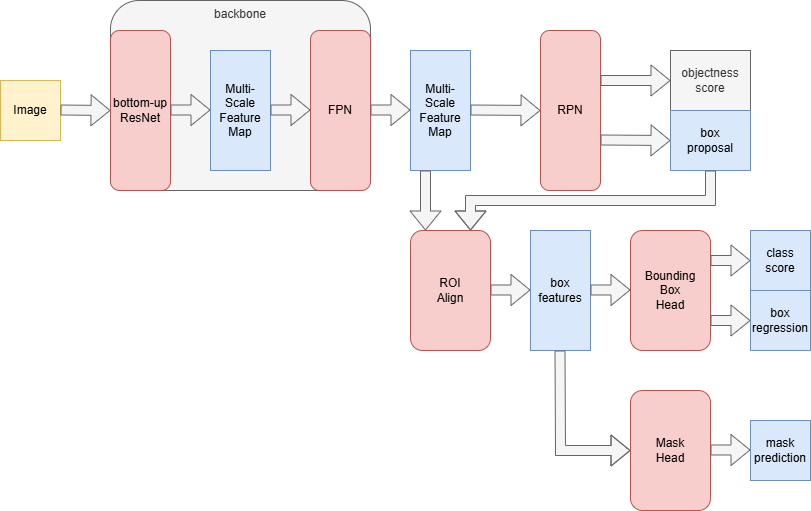
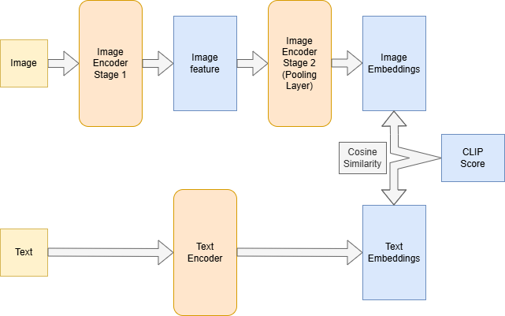
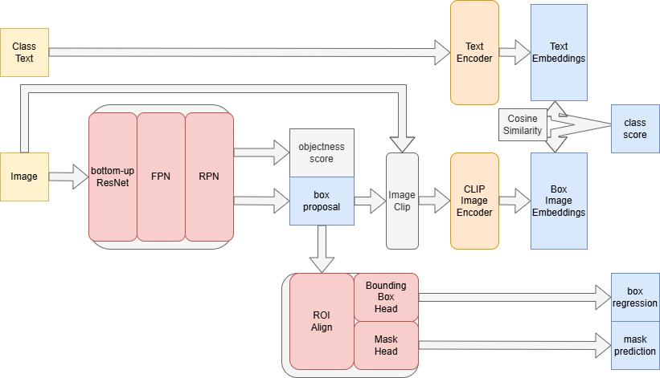
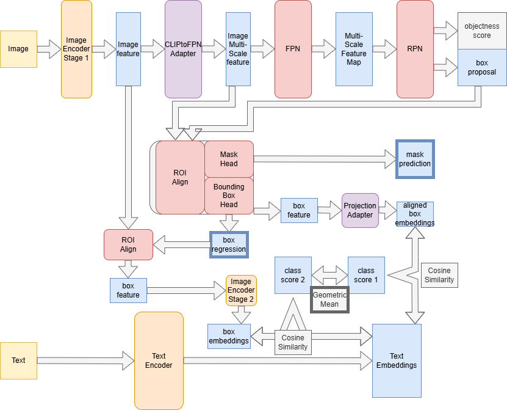

# Overview

本次任务是利用Mask R-CNN 与 CLIP 两个模型完成零样本开放字典实例检测与分割任务。

---

# 基础模型介绍

## Mask R-CNN

**Mask R-CNN** 是 R-CNN 系列模型的扩展，用于解决实例检测与分割任务。

过去R-CNN系列模型(R-CNN, Fast R-CNN, Faster R-CNN)主要用于解决目标检测任务。它们以多种方式给出大量锚框，对锚框进行筛选与预测。

Mask R-CNN 在 Faster R-CNN 的基础上增加了像素级分割的分支，能够为每个实例生成一个像素级掩码。它的像素级分割不依赖检测结果，可以与检测分支并行进行。

Mask R-CNN 是一个小模型，计算负载小，推理速度很快，但是不具备 Zero-Shot 能力。

Mask R-CNN 首先通过 backbone 提取多层次特征。这一特征首先送入 RPN。RPN 会给出区域提议并初步判断其是否为背景。此后 RPN 的区域提议与 FPN 的多层次特征会被一起送入 ROI Align。ROI Align 负责给出各提议区域的特征。这些区域特征会交给 Bounding Box Head 和 Mask Head。Bounding Box Head 会预测各个框的类别并对框给出偏移量，Mask Head 会给出物体的对应掩码。 

Mask Head 对每个框默认会针对全部类别都输出一个预测，但也可以设置为类别不可知模式，此时每个框只会有一个预测。

---

## CLIP

**CLIP** 是由文本 Encoder 与图像 Encoder 两部分构成的模型，用于获得文本与图像的对齐的 Embeddings。

CLIP 这项工作完成于 ViT 同期。CLIP 利用对比学习的方式将文本 Encoder 与图像 Encoder 输出的 Embeddings 中，对应的靠近，不对应的则远离。这意味着可以通过计算文本与图像 Embeddings 的余弦相似度，进而判断文本与图像的对应关系。

CLIP 的一大优势在于其 Zero-Shot 能力。它对图像的理解能力不再局限于固定的类别，而是能够判断图像与一段描述的接近程度。

CLIP 的模型规模较大，这导致其计算负载较大，推理速度较慢。但是这个模型规模为其带来了强大的泛化能力。

CLIP 的图像编码器在 F-VLM 中被描述为有两部分，分别是特征提取与池化。图中已经拆分体现。

# 我的解决方案

## 方案一：获取区域提案后使用 CLIP 处理裁剪图片以预测

我的第一个方案是，获取区域提案后使用 CLIP 处理裁剪图片以预测。

首先去掉 Mask R-CNN 的类型预测分支。

对于所有的类别，直接使用 CLIP 的 Text Encoder 处理其类名(或一段描述，如`a photo of a cat`)，获得类别对应的 Embedding。

在 FPN，RPN 后获得区域提议。接着依据此区域提议，对原始图片进行裁切，并将裁切得到的图像交给 CLIP 计算裁切图像的 Embedding。这里，裁切区域选择的不是经过 Bounding Box Head 调整后的，因为此输出在类别可知模式会让 CLIP 需要处理的图片数量乘上其检测的类别个数，极大地增加了计算量。

两个 Embedding 计算余弦相似度后，即可得到各个类别对应的分数。其余的`box regression`与`mask prediction`仍然沿用之前的计算方法。

### 方案一的优势

1. 此方法的大多数计算都是沿用之前的方法，代码比较好写。
2. 此方法不需要任何的进一步训练，可以直接应用预训练的模型。
3. 此方法能够较好地保持之前架构的预测性能，效果较好。

### 方案一的劣势
1. 此方法计算量巨大。每张图片经过 RPN 生成的`box proposal`有1000之巨，这意味着对于每张图片要进行1000次 CLIP 的推理。CLIP 本身的计算量巨大，这导致计算速度难以接受。
2. 此方法会造成严重的显存浪费。在CLIP计算阶段，其显存占用产生远高于其它阶段的峰值。为了弥补此劣势，我使用`CLIP_batch`，以限制同时推理 CLIP 的图片数量，并确保 Mask R-CNN 上能有更多图片的并行。

## 方案二：利用 F-VLM 的思想构建

此方案使用了 F-VLM 的思想来设计架构。

最终的输出仍然还是box、mask与class score，为方便查看，其边框均被加粗。

本架构要求 CLIP 相关参数被冻结，不进行训练。因此架构设计将让不产生 loss 的路径避免出现不属于 CLIP 的需要训练得到参数的部件。

本方案对类别到 CLIP prompt的处理为：`<cls>` -> `a photo of <cls>`，并在最后加上背景 prompt `a random photo with no specific object`。

### 推理过程

其将 CLIP 的 Image Encoder 分为两阶段。第一阶段将产生一个形状为`(B,d^2+1,C)`的image feature。对于第二维，$d$是 ViT 对图像的分割($d\times d$)，该维其余一位是CLS。我的设计将CLS抛弃，其余部分转换为形状为`(B,C,d,d)`的张量，即可将其视作图像的一种 feature。

为了让图像 feature 能够输入 FPN，我添加了 CLIPtoFPN Adapter，将其进行多规格的上采样，代替了原有的 `bottom_up` 步骤。此后的步骤与 Mask R-CNN 完全一致，经过 RPN 提议后交给 ROI Align，由 Mask Head 生成 masks，由 Bounding Box Head 生成调整后的 Boxes。

此时，Bounding Box Head 输出中间会产生一个 box feature，我为其添加了一个 Projection Adapter 来获取与 CLIP 对齐的 embeddings。此 embeddings 将会与 text embeddings 求余弦相似度，生成 `class score 1`。

另外，Image Encoder Stage 1生成的图像 feature 可以与 Bounding Box Head 输出的 Boxes 经 ROI Align 后成为各个 Boxes 的 feature，再由 CLIP 的 Image Encoder Stage 2 处理成为 embeddings，与文本 embeddings 求余弦相似度即可得到 `class score 2`。

最终的 class score 由 `class score 1` 与 `class score 2` 求几何平均值得到。

### 训练过程

对于其训练过程，其 box regression loss 与 mask loss 都与 Mask R-CNN 的原始损失求解方式一致。

由于 class score 2 的计算路径不涉及任何需要训练的参数，因此这一段路径不会在训练中被计算。

在计算 class score 1 时，进行了 aligned box embeddings 与 text embeddings 的余弦损失计算。在训练期间，会计算这二者的对比损失。

在训练过程中，我使用了 AdamW ，并使用调度器实现前期线性升温+后期余弦退火。经验证训练效果相对比较好。

> 这里有必要提到CLIP的阶段分配方案的设计细节与解释。
> 
> F-VLM 认为，CLIP 的两阶段分别为特征提取与池化两部分。这也是我最初尝试的设计。然而这种设计在实现中的效果并不好。其给出的 `score 2` 的效果很糟糕。
> 
> 我会尝试解释这种糟糕的原因。我的原架构将第一阶段的输出中的 CLS 去掉，利用其 patch 来还原出图像特征。然而在原 CLIP 中，这里输出的特征是用于直接交给池化层的，而交给池化层的部分只包含 CLS 部分，而不包含 patch 部分。这可能意味着除了 CLS 部分以外的部分的特征代表性是难以保证的。
> 
> 然而，CLIP 的特征提取部分也有自身的阶段，在代码中分为 `embeddings` 阶段与 `encoder` 阶段。在 `embeddings` 阶段输出的特征具有完全一致的、便利的形状，而且由于其输出仍然属于较早期的特征，因此可以认为其信息在对应位置仍然比较完整。经过实验，对这里输出的特征直接在框上做 ROI Align ，可以很好地得到局部的特征。再将此局部特征与 CLS 合并交给`encoder`部分以及池化部分，生成的 `score 2` 不需要额外的训练(也没有可训练的参数)，就能得到不错的效果。
> 
> 不过，此设计有一个缺陷。如果按照原架构利用最后的特征，其经过 ROI Align 后只需要对每个框生成一个特征向量，因为它将会直接被送入池化层，而池化层只需要接受一个特征向量。然而如果利用中间特征，由于其仍然需要交给 `encoder` 作为输入，因此仍然需要保持原形状，也就是针对每一个patch都要生成一个特征向量，这会导致输出量在此时暴增(因为此时第一维不再是batch_size，而是所有图片候选框的个数，这个数字已经很大，乘上patch的个数，通常是$7\times 7$，会超过处理能力)。通常，在这一步如果强行并行，会导致出现显存峰值。为了避免此情况，我只能使用循环以batch_size为单位计算。这为推理带来了性能瓶颈。
> 
> 在图片中，我仍然将CLIP分为特征提取与池化两阶段，不过 `encoder` 这一部分归于池化层部分了。

# 模型评估

## 方案一

考虑到模型的推理速度过慢，因此不对所有 COCO 测试集进行评测，仅给出测试集前10张图片的推理可视化结果。可视化后的图片见[`output/Solution1_res`](../output/Solution1_res)。

从这里可以看到，此模型的输出质量尚可，预测框与 Mask 的质量均不错，分类也往往正确。

## 方案二

本方案在 COCO 数据集上进行了微调训练。由于时间限制，仅在训练集上完整训练了1 epoch。这可能会对模型结果产生影响。

我使用微调了1个epoch的模型在完整的 COCO 测试集上进行了评估。评估的图片见[`output/output_final`](../output/output_final)。

### 实例检测任务性能

| Metric | Value |
|:-------|------:|
| **AP** (IoU=0.50:0.95) | 0.0025 |
| **AP50** (IoU=0.50) | 0.0113 |
| **AP75** (IoU=0.75) | 0.0004 |
| **APs** (small) | 0.0000 |
| **APm** (medium) | 0.0002 |
| **APl** (large) | 0.0049 |
| **AR@1** | 0.0064 |
| **AR@10** | 0.0089 |
| **AR@100** | 0.0089 |
| **AR_l** | 0.0000 |

### 实例分割任务性能

| Metric | Value |
|:-------|------:|
| **AP** (IoU=0.50:0.95) | 0.0009 |
| **AP50** (IoU=0.50) | 0.0048 |
| **AP75** (IoU=0.75) | 0.0000 |
| **APs** (small) | 0.0000 |
| **APm** (medium) | 0.0001 |
| **APl** (large) | 0.0018 |
| **AR@1** | 0.0027 |
| **AR@10** | 0.0035 |
| **AR@100** | 0.0035 |
| **AR_l** | 0.0000 |

### 整体性能指标

| 指标 | 值 |
| :--- | :--- |
| **Accuracy** | 0.2108 |
| **Precision** | 0.1987 |
| **Recall** | 0.1456 |
| **F1-score** | 0.1274 |
| **Macro Avg Precision** | 0.1987 |
| **Macro Avg Recall** | 0.1456 |
| **Macro Avg F1-score** | 0.1274 |
| **Weighted Avg Precision** | 0.2687 |
| **Weighted Avg Recall** | 0.2108 |
| **Weighted Avg F1-score** | 0.2031 |
| **Support (总样本数)** | 35012 |

### 各类别性能指标

| 类别 | Precision (精确率) | Recall (召回率) | F1-score | Support (样本数) |
| :--- | :--- | :--- | :--- | :--- |
| person | 0.4117 | 0.3632 | 0.3860 | 10544 |
| bicycle | 0.1245 | 0.3247 | 0.1800 | 308 |
| car | 0.2731 | 0.1559 | 0.1985 | 1879 |
| motorcycle | 0.2714 | 0.3025 | 0.2861 | 367 |
| airplane | 0.2174 | 0.1163 | 0.1515 | 129 |
| bus | 0.1047 | 0.5669 | 0.1767 | 284 |
| train | 0.2015 | 0.5775 | 0.2988 | 187 |
| truck | 0.1890 | 0.0583 | 0.0891 | 412 |
| boat | 0.1982 | 0.3811 | 0.2608 | 412 |
| traffic light | 0.2222 | 0.0137 | 0.0258 | 584 |
| fire hydrant | 0.1667 | 0.0105 | 0.0198 | 95 |
| stop sign | 0.3333 | 0.3699 | 0.3506 | 73 |
| parking meter | 0.0000 | 0.0000 | 0.0000 | 56 |
| bench | 0.1429 | 0.0026 | 0.0052 | 379 |
| bird | 0.2662 | 0.1636 | 0.2026 | 428 |
| cat | 0.2819 | 0.3368 | 0.3070 | 190 |
| dog | 0.2421 | 0.3239 | 0.2771 | 213 |
| horse | 0.1857 | 0.5410 | 0.2765 | 268 |
| sheep | 0.5249 | 0.7543 | 0.6190 | 350 |
| cow | 0.4974 | 0.2534 | 0.3357 | 371 |
| elephant | 0.6538 | 0.5375 | 0.5900 | 253 |
| bear | 0.6000 | 0.4091 | 0.4865 | 66 |
| zebra | 0.8670 | 0.7052 | 0.7778 | 268 |
| giraffe | 0.9608 | 0.2207 | 0.3590 | 222 |
| backpack | 0.0000 | 0.0000 | 0.0000 | 364 |
| umbrella | 0.1280 | 0.0818 | 0.0998 | 391 |
| handbag | 0.0000 | 0.0000 | 0.0000 | 523 |
| tie | 0.0064 | 0.0118 | 0.0083 | 254 |
| suitcase | 0.6667 | 0.0491 | 0.0915 | 285 |
| frisbee | 0.0000 | 0.0000 | 0.0000 | 110 |
| skis | 0.1082 | 0.1082 | 0.1082 | 231 |
| snowboard | 0.1228 | 0.2121 | 0.1556 | 66 |
| sports ball | 0.0594 | 0.0229 | 0.0331 | 262 |
| kite | 0.0000 | 0.0000 | 0.0000 | 308 |
| baseball bat | 0.0000 | 0.0000 | 0.0000 | 142 |
| baseball glove | 0.0000 | 0.0000 | 0.0000 | 145 |
| skateboard | 0.2308 | 0.0195 | 0.0359 | 154 |
| surfboard | 0.4627 | 0.1366 | 0.2109 | 227 |
| tennis racket | 0.1099 | 0.1364 | 0.1217 | 220 |
| bottle | 0.0712 | 0.1306 | 0.0922 | 980 |
| wine glass | 0.2078 | 0.0497 | 0.0802 | 322 |
| cup | 0.1045 | 0.0554 | 0.0724 | 830 |
| fork | 0.4000 | 0.0309 | 0.0574 | 194 |
| knife | 0.0171 | 0.0461 | 0.0250 | 282 |
| spoon | 0.0000 | 0.0000 | 0.0000 | 223 |
| bowl | 0.0964 | 0.0140 | 0.0244 | 573 |
| banana | 0.1111 | 0.0058 | 0.0110 | 344 |
| apple | 0.0129 | 0.0191 | 0.0154 | 209 |
| sandwich | 0.0341 | 0.0204 | 0.0255 | 147 |
| orange | 0.0000 | 0.0000 | 0.0000 | 256 |
| broccoli | 0.7000 | 0.0251 | 0.0484 | 279 |
| carrot | 0.0000 | 0.0000 | 0.0000 | 321 |
| hot dog | 0.0000 | 0.0000 | 0.0000 | 118 |
| pizza | 0.2752 | 0.1132 | 0.1604 | 265 |
| donut | 1.0000 | 0.0205 | 0.0403 | 292 |
| cake | 0.1310 | 0.3787 | 0.1947 | 301 |
| chair | 0.3000 | 0.0017 | 0.0035 | 1725 |
| couch | 0.1277 | 0.0238 | 0.0401 | 252 |
| potted plant | 0.0000 | 0.0000 | 0.0000 | 326 |
| bed | 0.1420 | 0.2893 | 0.1905 | 159 |
| dining table | 0.0759 | 0.0187 | 0.0300 | 643 |
| toilet | 0.3961 | 0.3506 | 0.3720 | 174 |
| tv | 0.0190 | 0.3523 | 0.0361 | 281 |
| laptop | 0.1958 | 0.1239 | 0.1518 | 226 |
| mouse | 0.0000 | 0.0000 | 0.0000 | 104 |
| remote | 0.0000 | 0.0000 | 0.0000 | 282 |
| keyboard | 0.0509 | 0.2781 | 0.0861 | 151 |
| cell phone | 0.0439 | 0.1120 | 0.0631 | 259 |
| microwave | 0.0000 | 0.0000 | 0.0000 | 54 |
| oven | 0.1765 | 0.0217 | 0.0387 | 138 |
| toaster | 0.0000 | 0.0000 | 0.0000 | 9 |
| sink | 0.3333 | 0.0047 | 0.0093 | 213 |
| refrigerator | 0.1429 | 0.0500 | 0.0741 | 120 |
| book | 0.1352 | 0.4014 | 0.2023 | 1141 |
| clock | 0.3197 | 0.3047 | 0.3120 | 256 |
| vase | 0.0000 | 0.0000 | 0.0000 | 270 |
| scissors | 0.0000 | 0.0000 | 0.0000 | 34 |
| teddy bear | 0.4444 | 0.1348 | 0.2069 | 178 |
| hair drier | 0.0000 | 0.0000 | 0.0000 | 6 |
| toothbrush | 0.0000 | 0.0000 | 0.0000 | 55 |

从这里的结果可以看出，这个模型的效果本身并不好。

实例检测与实例分割任务上表现均比较差，模型仅在大物体上有一定的检测能力，同时生成的 mask 质量非常差。

模型总体的分类性能也不算好，准确率较低。这可能也与框的预测精度不高有关。

### 针对方案二的反思

1. 训练步数可能不够。本次训练由于时间关系，仅训练了1 epoch，在结束训练时，其损失仍在下降中。可能其并未得到充分优化。
2. 模型分类的能力有 CLIP 本身的性能托底。分类数值上性能低的原因可能更多在于获得的候选框质量不佳。若能提升候选框质量，应该能够提升分类性能。
3. 考虑换patch更精细的 CLIP 模型。我使用的 CLIP 模型是最小的版本，即$7\times 7$ patch 的版本。由于图像输入完全依赖 CLIP 模型的特征提取，更大的patch数量意味着对图片位置的把控更精确。事实上，方案二的可视化输出也证明了这一点。模型的分类往往会受到接近框但不包含在框中的物体的影响，导致分类倾向于框外的物体。这可能就是patch过小导致的。
4. 尽管效果目前还不够好，但是应当指出的是，目前模型展示的性能表明其应用 CLIP 得到的特征进行进一步实例检测与分割的能力是确实存在的。基于此架构进一步提升模型的能力应当是可以做到的。

# 自己的图片

我给出了一些自己的图片用于预测，分别使用两种方案进行实现

## Solution 1
结果可见于[output/my_image_test_sol1/](../output/my_image_test_sol1)，下面展示：

## Solution 2
结果可见于[output/my_image_test/](../output/my_image_test)。下面展示：

